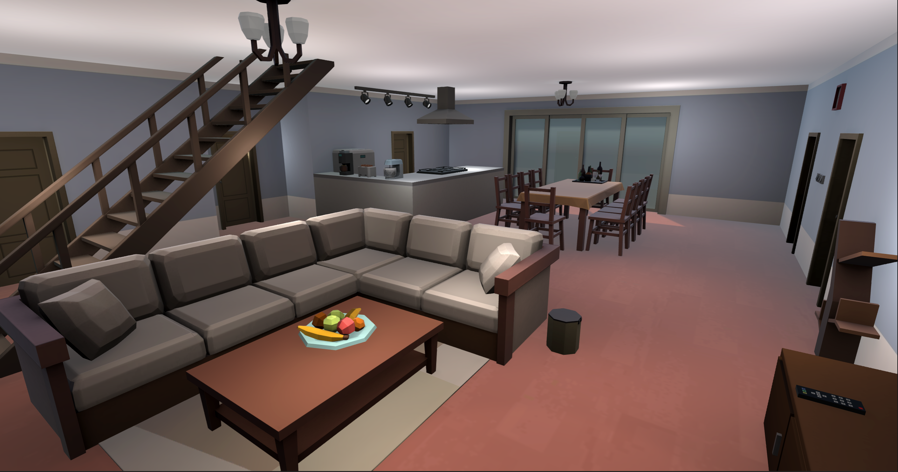
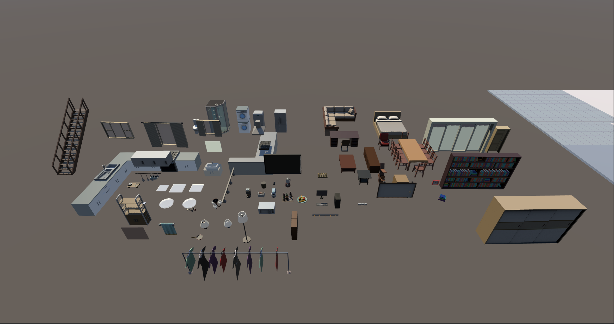
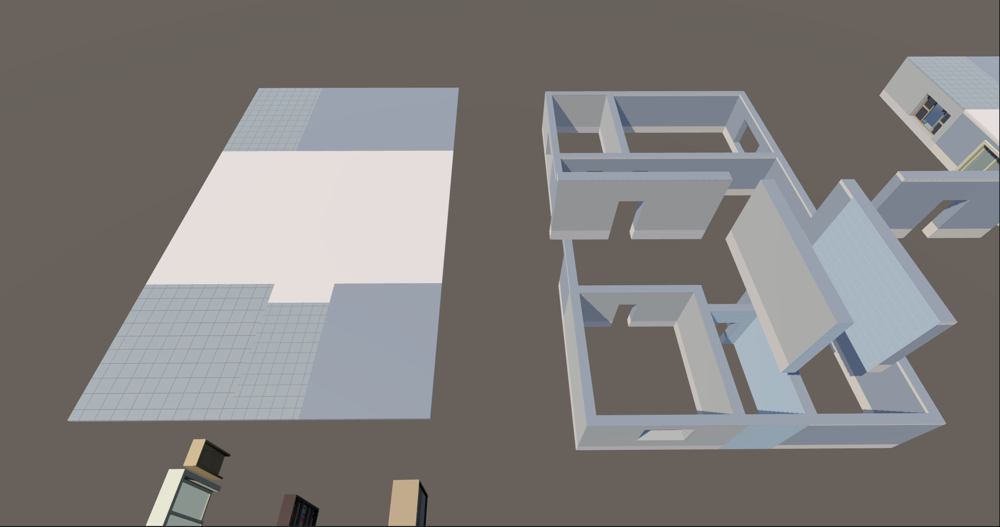
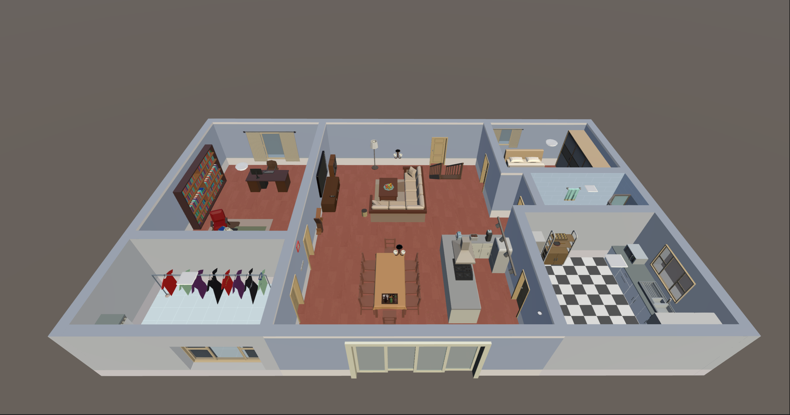

LowPolyHome Unity Package Assets

## Tools
### PrefabLightmapping
> https://github.com/Ayfel/PrefabLightmapping
> 
> Script for saving lightmapping data to prefabs

## Assets Infomation

Tris: 90k

Materials: 77

Textures include: Albedo, AO and Emission

Albedo: 77
AO: 68
Emission: 12

Materials are set up for URP renderpipeline

